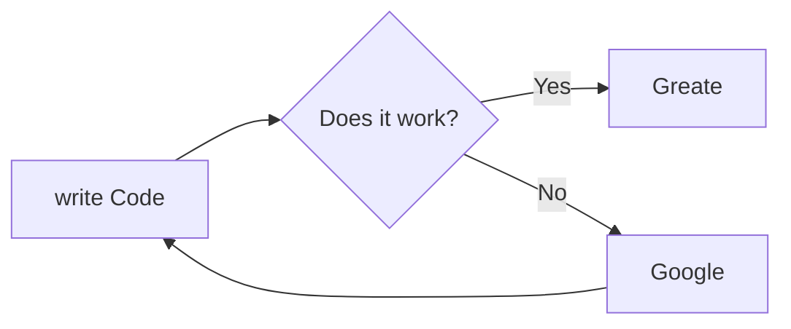

<!--заголовки-->

[cd](#span-stylecolor93b7beвидосы-с-you-tubespan)

## <span style="color:#93B7Be">заголовки:</span>

# заголовок 1-уровня

## заголовок 2-уровня

### заголовок 3-уровня

#### заголовок 4-уровня

##### заголовок 5-уровня

###### заголовок 6-уровня

<!--выделения-->

## <span style="color:#93B7Be">Выделения</span>

_курсив_

_курсив_

**Жирный шрифт**

**Жирный шрифт**=

~~Перечёркнутый текст~~

~~Перечёркнутый текст~~

**_Жирный шрифт + курсив_** или **_Жирный шрифт + курсив_**

## <span style="color:#93B7Be">списки</span>

<!--списки-->

- list
  - вложенный
- list
- list

1. элемент
   - вложенность
2. элемент
   1. супер мега вложенность
   2. супер мега вложенность
   3. супер мега вложенность
   4. супер мега вложенность
   5. супер мега вложенность
   6. супер мега вложенность
   7. супер мега вложенность
3. элемент

## <span style="color:#93B7Be">ссылка</span>

<!--ссылка -->

[Google](https://google.com)

## <span style="color:#93B7Be">код</span>

<!-- код -->

ну типо, в Python вывод делает функция `print()`

```python
for i in range(1, 2, 3):
    print("hello world")
```

```C
int i;
for (i = 0; i < 100; i++){
    printf("%i",i);
}
```

```Python
i = 0
i+=1
print(i)
```

## <span style="color:#93B7Be">картинки</span>

<!-- картинки -->


## <span style="color:#93B7Be">цитаты</span>

<!-- цитаты -->

> цитата
>
> ещё цитата

## <span style="color:#93B7Be">Горизонтальный разделители</span>

<!-- Горизонтальный разделители -->

---

---

---

## <span style="color:#93B7Be">таблицы</span>

<!-- таблицы -->

[gentrator](https://www.youtube.com/redirect?event=video_description&redir_token=QUFFLUhqbmdGenZEd1lkNHA5QXRVVTFIRkVuTW9ZVnZWd3xBQ3Jtc0tsNEpGQVBIU2R5Yi01Q1hyTXZiOGEwOC15b0dETVRCbGZ3U2g3aXlSU3UwVWlrckxPb0RKbXVQLVBaUUEtWlNWT3EzRGFyOFpUSV9mcVJiNFRGcFBKa21PcUxZYVJKRFdiQUVFODJaSzBJZ20zQmRicw&q=https%3A%2F%2Fwww.tablesgenerator.com%2Fmarkdown_tables&v=jPKi2Addbxw)


| кол-во минут | процесс 1 | процесс 2 | процесс 3 | процесс 4 |
| :--------------------: | :--------------: | :--------------: | :--------------: | :--------------: |
|           1           |        89        |        83        |        23        |        8        |
|           2           |       456       |        88        |        9        |        0        |
|           3           |       200       |       180       |        30        |        2        |

## <span style="color:#93B7Be">список дел</span>

<!-- список дел -->

- [X]  какое-то дело 1
- [ ]  какое-то дело 2
- [ ]  какое-то дело 3

## <span style="color:#93B7Be">видосы с you-tube</span>

span

[](https://www.youtube.com/live/jfKfPfyJRdk?si=n5ZWyFca7iNznSap)

[cd](#span-stylecolor93b7beвидосы-с-you-tubespan)

<!-- видосы с you-tube -->

## <span style="color:#93B7Be">Диограммы</span>



<!-- матеша -->

## <span style="color:#93B7Be">математические формулы</span>

When $a \ne 0$, there are two solutions to $(ax^2 + bx + c = 0)$ and they are

$$
x = {-b \pm \sqrt{b^2-4ac} \over 2a}
$$

$ f(x) = kx+b$


0